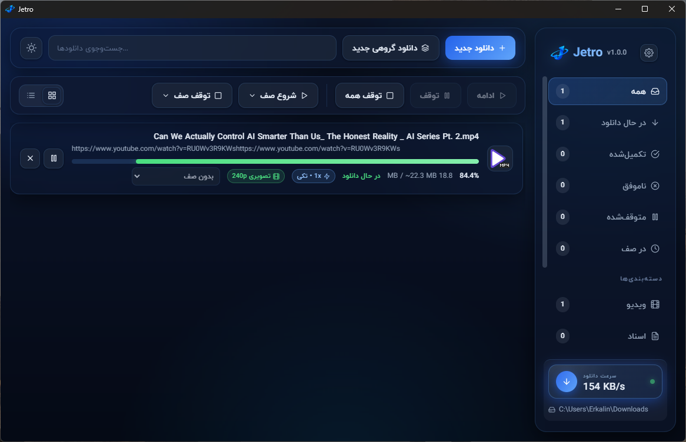

<div dir="rtl" lang="fa">

<div align="center">


<p><strong>یک دانلود منیجر مدرن و حرفه ای برای ویندوز مجهز به موتور چنداتصاله، باندل شده با ابزار yt-dlp برای دانلود ویدیو و آهنگ از بیشتر از 1000 شبکه اجتماعی.</strong></p>

<p>
  <a href="package.json"></a>
  <a href="https://github.com/Erkalin/Jetro/releases"></a>
  <a href="LICENSE"></a>
</p>

<p>
  <a href="README.md">🇬🇧 English README</a>
</p>

</div>

---

## 👀 پیش‌ نمایش



## 📥 دانلود

آخرین نسخه را از صفحه [**Releases**](https://github.com/Erkalin/Jetro/releases) دریافت کنید.

| سیستم‌عامل | فایل | نحوه اجرا |
| -- | ---- | ---------- |
| 🪟 ویندوز ۶۴ بیتی (پرتابل) | `Jetro.exe` | اجرای مستقیم، بدون نیاز به نصب |
| 🪟 ویندوز ۶۴ بیتی (نصبی) | `Jetro Setup.exe` | نصب با میان‌بر دسکتاپ و منوی استارت |

این نسخه شامل تمامی ابزارهای موردنیاز برای دانلود ویدیو و آهنگ (`yt-dlp`، `ffmpeg` و `quickjs`) است و به نصب جداگانه نیازی ندارد. داشتن حافظه خالی `حداقل 300 مگابایت` پیشنهاد می شود.

## ✨ قابلیت‌ها

### 📥 مدیریت دانلود

- موتور چندبخشی با 1 تا 32 اتصال همزمان برای هر فایل
- محدودیت سرعت سراسری + تنظیم تعداد اتصال برای هر دانلود
- تلاش مجدد خودکار با تأخیر نمایی در صورت بروز خطا
- دانلود گروهی (Batch): افزودن همزمان تا 200 فایل با الگوی `*`، همراه با پیش‌نمایش و بررسی لینک‌ها
- صفحه‌بندی فهرست دانلودها: نمایش `Showing X–Y of Z` با اندازه صفحه (`10`، `25`، `50`، `100`، `همه`)، دکمه‌های قبلی/بعدی + شماره صفحات؛ انتخاب ذخیره می‌شود و با تغییر فیلتر/جستجو ریست می‌شود
- پنجره «دانلود جدید» انباشته: لینک‌های پشت‌سرهم (جای‌گذاری، حافظه موقت، `jetro://`) روی هم انباشته می‌شوند (LIFO تا 20 مورد) با نشان `+n queued` به‌جای جایگزینی

### 🎬 ویدیو و صوت

مبتنی بر `yt-dlp` و `ffmpeg` داخلی. از لینک‌های یوتیوب، تیک‌تاک، اینستاگرام، ردیت، ویمئو، توییچ، فیسبوک، ایکس و [بیش از 1000 وب‌سایت دیگر](https://github.com/yt-dlp/yt-dlp/blob/master/supportedsites.md) پشتیبانی می‌شود.

- تشخیص کیفیت تصویر (از `144p` تا `8K`) و انتخاب فرمت `mp4`
- دانلود صوت با بهترین کیفیت موجود + زیرنویس انگلیسی (در صورت وجود)
- پشتیبانی از پلی‌لیست: نمایش 50 مورد نخست؛ هر مورد انتخاب‌شده به یک دانلود مستقل تبدیل می‌شود
- پشتیبانی از کوکی برای وب‌سایت‌های نیازمند ورود (درج محتوای `txt` یا انتخاب فایل)
- تشخیص دستی: دکمه «این صفحه ویدیو/صوت است؟ برای تشخیص کلیک کنید» برای لینک‌های مبهم + گزینه «صفحه ویدیویی نیست — دانلود به‌صورت فایل مستقیم»؛ عنوان شناسایی‌شده به‌صورت خودکار نام فایل می‌شود؛ شکست تشخیص به دانلود فایل برمی‌گردد
- محافظ استریم: لینک‌های مستقیم `.m3u8` / `.mpd` با راهنمایی دانلود به‌صورت ویدیو رد می‌شوند؛ سایت‌های دارای محافظ هات‌لینک `--referer` می‌گیرند، دامنه بدون پروتکل `https://` می‌گیرد و فرگمنت‌های ویدیو با `--concurrent-fragments 8` دانلود می‌شوند

> دانلودهای ویدیویی توسط yt-dlp مدیریت می‌شوند و مشمول صف‌بندی نیستند.

### 🗂️ صف‌ها و زمان‌بندی (زمان‌بند جدید در نسخه ۱٫۲٫۰)

- گروه‌بندی دانلودها در صف‌ها با امکان شروع و توقف گروهی؛ «ساخت صف جدید» فقط نام می‌گیرد — زمان‌بندی در پنجره Scheduler انجام می‌شود؛ دکمه‌های شروع/توقف صف بدون کار (خالی یا کامل‌شده) غیرفعال‌اند؛ منوها شمار زنده + نام کوتاه‌شده نشان می‌دهند؛ صف‌های گروهی با نام `Batch – host` ساخته می‌شوند
- پنجره Scheduler به‌سبک IDM با دو زبانه `Schedule` و `Files`: «شروع دانلود هنگام اجرای جترو»، «شروع دانلود در ساعت» (`تک‌بار` + تاریخ / `روزانه` + انتخاب روزهای هفته) و «توقف در ساعت» (`HH:MM`)، تعداد فایل همزمان هر صف (سقف: تنظیمات سراسری)، تلاش مجدد هر فایل (`تنظیمات سراسری` یا `0–10`)، «باز کردن فایل پس از اتمام»، «خروج از جترو پس از اتمام» و «خاموش کردن سیستم» با گزینه «بستن اجباری پردازش‌ها»؛ زبانه فایل‌ها با ستون‌های نام/حجم/وضعیت/زمان باقی‌مانده، جابه‌جایی اولویت (`Move up` / `Move down`)، حذف از صف (`Delete file` / `Keep file`) و دکمه‌های `Start now` / `Stop` / `Apply` / `Close` (`Ctrl+S` برای اعمال)
- اقدام پایانی صف: `Sleep` / `Hibernate` / `Shutdown` / `Restart` با پنجره شمارش معکوس 60 ثانیه‌ای

### 🌍 زبان و ظاهر

- رابط کاربری کامل به 40 زبان از بخش تنظیمات با انتخاب‌گر پرچم (انگلیسی و فارسی در ابتدای فهرست): انگلیسی، فارسی، عربی، ترکی، فرانسوی، آلمانی، اسپانیایی، روسی، چینی ساده‌شده، هندی، پرتغالی، ایتالیایی، هلندی، ژاپنی، کره‌ای، اردو، اندونزیایی، لهستانی، اوکراینی، ویتنامی، چینی سنتی، عبری، کردی سورانی، آذربایجانی، بنگالی، تامیل، تلوگو، تایلندی، مالایی، فیلیپینی، سوئدی، نروژی، دانمارکی، فنلاندی، یونانی، مجاری، چکی، رومانیایی، پرتغالی برزیل و اسپانیایی آمریکای لاتین. انگلیسی و فارسی به‌صورت انسانی ترجمه شده‌اند؛ 38 زبان دیگر با هوش مصنوعی ترجمه شده‌اند — لطفاً خطاها را از طریق [Issues](https://github.com/Erkalin/Jetro/issues) گزارش دهید
- چیدمان راست‌به‌چپ برای زبان‌های فارسی، عربی، اردو، عبری و کردی، همراه با فونت ایران‌یکان (به‌صورت داخلی در برنامه)
- گالری 27 تم (`Jetro`، `Midnight`، `System`، `Gray`، `Silver`، `Crimson`، `Coral`، `Amber`، `Teal`، `Navy`، `Turquoise`، `Indigo`، `Aqua`، `Nord`، `Dracula`، `Solarized`، `Forest`، `Blossom`، `Espresso`، `Lavender`، `Ember`، `Pistachio`، `Ruby`، `Scarlet`، `Gold`، `Hunter`، `Clover`) با پیش‌نمایش فوری + دکمه تغییر سریع در نوار بالایی (تنظیمات قبلی `روشن`/`تیره` به‌صورت خودکار به `Jetro`/`Midnight` منتقل می‌شوند)
- گزینه «اجرا هنگام شروع ویندوز» (فقط در نسخه نصبی؛ در نسخه پرتابل غیرفعال است): شروع کمینه در سینی سیستم + پاک‌سازی خودکار ورودی‌های قدیمی استارتاپ

### 📊 جزئیات و سرعت (جدید در نسخه ۱٫۰٫۰)

- پنجره «جزئیات و سرعت» برای هر دانلود: نمایش سرعت لحظه‌ای، میانگین، اوج سرعت و نمودار سرعت در طول زمان
- نمایش پیشرفت هر اتصال به‌صورت جداگانه، به‌همراه نام میزبان، آدرس IP و موقعیت تقریبی سرور

### ✅ تکمیل دانلود و رفتار دکمه‌ها (جدید در نسخه ۱٫۲٫۰)

- پنجره تجمیعی «دانلود کامل شد» (`+n more finished` با امکان باز کردن فهرست) به‌جای یک پنجره برای هر فایل؛ `Dismiss` همه را می‌بندد و باز کردن فایل/پوشه سراغ بعدی می‌رود؛ گزینه `Show download-complete popup` در تنظیمات → عمومی (پیش‌فرض روشن)
- دکمه `Pause` فقط برای `queued` یا دانلود غیر yt-dlp فعال است (در حالت `merging` و دانلود yt-dlp خاکستری/غیرفعال)
- اعلان‌های داخل برنامه به‌جای `alert`/`confirm` سیستمی (عنوان `Jetro`، راست‌به‌چپ، بستن با `Esc`)؛ حذف صف با پنجره تأیید؛ پنجره «دانلود جدید» با کلیک روی پس‌زمینه بسته نمی‌شود

### 🧩 افزونه مرورگر (جدید در نسخه ۱٫۰٫۰)

- افزونه Jetro Resolver برای مرورگرهای کرومیوم (کروم، اج، بریو) و فایرفاکس، واقع در پوشه `extension/`
- ارسال لینک، تصویر، ویدیو یا صفحه جاری به برنامه از طریق منوی راست‌کلیک
- باز کردن مستقیم لینک‌های فایل در جترو به‌جای دانلود توسط مرورگر
- ارتباط با برنامه دسکتاپ از طریق پروتکل `jetro://` (پس از یک‌بار اجرای برنامه ثبت می‌شود). راهنمای نصب در [`extension/README.md`](extension/README.md) ارائه شده است.

### 🌐 پروکسی

- حالت‌های اتصال: مستقیم، پروکسی سیستم یا پروکسی دستی (`HTTP` / `HTTPS` / `SOCKS4` / `SOCKS5` با احراز هویت)
- نمایش راهنمای تنظیمات پروکسی در صورت بروز خطای مرتبط با دسترسی شبکه هنگام تشخیص ویدیو

### ⚙️ سایر تنظیمات

- پوشه پیش‌فرض دانلود، تعداد اتصال‌ها، تعداد دانلودهای همزمان، محدودیت سرعت، رهگیری خودکار حافظه موقت (Clipboard)، نمایش پنجره تکمیل دانلود (`Show download-complete popup`، پیش‌فرض روشن)
- نمایش آیکون واقعی فایل‌های ویندوز در فهرست، پشتیبانی از سینی سیستم، اجرا هنگام شروع ویندوز (فقط نسخه نصبی) و بررسی به‌روزرسانی
- گزینه «بازنشانی کامل» در بخش تنظیمات: توقف تمامی دانلودها و پاک‌سازی فهرست، صف‌ها، تنظیمات و تاریخچه سرعت (فایل‌های ذخیره‌شده در دیسک حفظ می‌شوند)

---

## 🚀 راه‌اندازی برای دولپر ها

> پیش‌نیازها: [Node.js](https://nodejs.org/) نسخه ۲۰ یا بالاتر + ویندوز.

```powershell
# 1️⃣ نصب وابستگی‌ها
npm install

# 2️⃣ دریافت ابزارهای ویدیویی در پوشه bin
npm run fetch:binaries

# 3️⃣ اجرای کامل برنامه
npm run app:dev
```

دستورات پرکاربرد:

| دستور | توضیح |
| ------- | ----------- |
| `npm run app:dev` | اجرای کامل (Vite + Electron) |
| `npm run electron:build` | ساخت نسخه با ffmpeg (پرتابل + نصبی): `release/` (`Jetro.exe` و `Jetro Setup.exe`، همراه با ffmpeg) |
| `npm run test:engine` | تست موتور دانلود بدون رابط گرافیکی |

---

## 🤝 مشارکت

گزارش خطا و پیشنهادها از طریق صفحه [[Issues](https://github.com/Erkalin/Jetro/issues)] پذیرفته می‌شود.

## 📄 کپی رایت

2026  ©  Erkalin 💙

</div>
