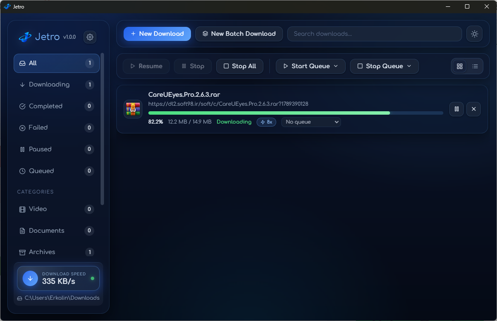
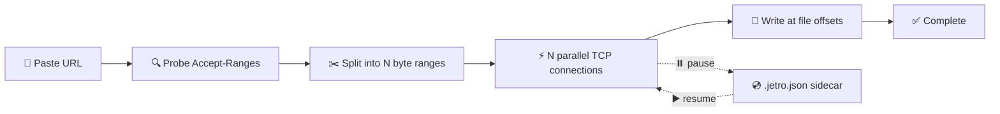

<div align="center">


<p><strong>A modern download manager for Windows with a segmented multi-connection
engine, video &amp; audio downloads, batch downloads, queues with schedules,
proxy support, and a clean glass-style UI with light/dark themes.</strong></p>

<p>
<a href="package.json"></a>
  <a href="https://github.com/Erkalin/Jetro/releases"></a>
  <a href="https://www.electronjs.org/"></a>
  <a href="https://react.dev/"></a>
  <a href="LICENSE"></a>
</p>

<p>
  <a href="#-preview">👀 Preview</a> •
  <a href="#-features">✨ Features</a> •
  <a href="#-getting-started">🚀 Getting Started</a> •
  <a href="#-project-structure">📁 Project Structure</a> •
  <a href="#️-how-downloading-works">⚙️ How It Works</a>
</p>

</div>

---

## 👀 Preview



## 📥 Download

No installation needed — download, run, done. Get the latest version from the
[**Releases page**](https://github.com/Erkalin/Jetro/releases).

| OS | File | How to run |
| -- | ---- | ---------- |
| 🪟 Windows x64 | `Jetro <version>.exe` | Double-click to run |

The portable build includes everything needed for video & audio downloads
(`yt-dlp`, `ffmpeg`/`ffprobe`, `quickjs`) — no separate installs required.

## ✨ Features

### 📥 Downloading

| Feature | Description |
| ------- | ----------- |
| ⚡ Segmented engine | 1–32 parallel `Range` connections per file |
| ⏯️ Pause & resume | Resume support via `.jetro.json` sidecar files |
| 🚦 Speed control | Global speed limit presets (`Unlimited`, `100 KB/s`, `256 KB/s`, `512 KB/s`, `1 MB/s`, `2 MB/s`, `5 MB/s`, `10 MB/s`) + per-download connections (`1`, `4`, `8`, `16`, `32`) |
| 🔁 Auto-retry | Failed downloads are re-queued with exponential backoff instead of stopping at error |
| 📦 Batch download | Add up to 200 file parts at once with a `*` pattern (numbers or letters), with live preview and link resolving |
| 📂 Collision handling | `File already exists` dialog with `Replace file` / `Keep both` / `Cancel` |
| ✏️ Rename | Rename a download; the file on disk is renamed too |
| 🔄 Redownload | Delete the file and download it again |
| ↻ Refresh | Re-check a link for a new size (paused/failed/completed file links) |
| ⚙️ Safe settings | Unsaved-changes guard so you never lose edits by accident |

### 🎬 Video & Audio

Powered by the bundled `yt-dlp` + `ffmpeg`, with `quickjs` for player challenges.
Paste a link from YouTube, TikTok, Instagram, Reddit, Vimeo, Dailymotion,
Twitch, Facebook, X/Twitter and
[1000+ more websites](https://github.com/yt-dlp/yt-dlp/blob/master/supportedsites.md).

| Feature | Description |
| ------- | ----------- |
| 🔍 Detect qualities | `Detect qualities` / `Detect again` with `Show details` / `Hide details` log |
| 🎞️ Video picker | `VIDEO — pick a height (no cap)`: `{height}p · {ext}` with merge and `~size` estimate (e.g. `720p · mp4`), merged to `mp4` |
| 🎧 Audio picker | `AUDIO — best available per format`: `{ext} · {abr}k`, plus `mp3` extract option |
| 💬 Subtitles | `Subtitles (EN)` — writes and embeds English subtitles when available |
| 📃 Playlists | `PLAYLIST — {count} videos` (first 50 shown) with `Select all` / `Clear`; each selection becomes its own download |
| 🍪 Cookies | Login support via pasted `cookies.txt` content or a cookie file from disk, with `Retry with cookies` and a cookie-exporter extension link |
| 🛠️ Bundled tools | `yt-dlp` + `ffmpeg`/`ffprobe` + `quickjs` shipped in `bin/` and auto-resolved (custom `yt-dlp` path supported) |

> Video/audio downloads run via yt-dlp, which manages its own connections —
> queues don't apply.

### 🗂️ Queues & Scheduler

| Feature | Description |
| ------- | ----------- |
| 🗂️ Queues | Group downloads, start/stop together; concurrency follows the global `Concurrent downloads` setting |
| 🕐 Scheduler | Per-queue 24-hour time windows (e.g. `22:00–07:00`, overnight supported) with `Run only on schedule` and `Start` / `Stop` (`HH:MM`) |
| ⏻ Power action | `When queue finishes (all completed)`: `Do nothing` / `Sleep` / `Hibernate` / `Shutdown` / `Restart`, with a 60-second countdown dialog (`{Action} now` / `Cancel`); fires only when every file in the queue is completed |
| ➕ Queue from menu | `New queue…` directly from the `Add to queue` submenu |

### 🗃️ Organization & Views

| Feature | Description |
| ------- | ----------- |
| 🏷️ Categories | Video, documents, archives, software, others |
| 🃏 Card view | Classic cards with progress, speed and actions |
| 📋 Details view | Small File-Explorer-like list with columns `File Name`, `Queue`, `Status`, `Size`, `Download Speed`, `ETA`, `Last Try` — click to sort, drag to reorder, drag edge to resize |
| 🔍 Filters & search | Status filters plus instant filename/URL search |
| 🖱️ Context menu | Right-click any download: `Open`, `Open with` (choose app), `Open Folder`, `Rename`, `Redownload`, `Stop` / `Resume`, `Refresh`, `Remove`, `Add to queue` / `Remove from queue`, `Properties`; double-click a completed file to open it |
| 📄 Properties | `File name`, `URL`, `Save path`, `Status`, `Size`, `Speed`, `Connections`, `Category`, `Queue`, `Created`, `Last try`, `Source` (video height/audio), `Error`, with `Open Folder` |
| 🖼️ OS file icons | Shows the same icon File Explorer uses |
| 📋 Clipboard capture | `Clipboard auto-capture` — paste a link and Jetro picks it up automatically; drop links or a `.txt` file onto the list to add up to 200 downloads |
| 🔔 Notifications | Download-complete popups with `Open file` / `Open folder` / `Dismiss` |

### 🎨 Appearance & System

| Feature | Description |
| ------- | ----------- |
| 🌗 Appearance | `Light` / `Dark` / `System` (follows OS), with live preview and a header sun/moon toggle |
| 📌 System tray | `When I click the X button`: `Ask every time` / `Minimize to tray` / `Exit app`, with `Remember my choice`; tray menu with `Show` and `Quit`; single instance; downloads continue while minimized |
| 🔄 Update check | `Check for updates on startup` plus manual `Check now` (GitHub Releases) and an in-app banner (`Download` / `Later`) with `● v{latest} available` / `● v{current} up to date` status |

### 🌐 Network & Privacy

| Feature | Description |
| ------- | ----------- |
| 🌍 Proxy modes | `No proxy (direct connection)`, `Use system proxy` (OS settings / PAC / env fallback), or `Custom proxy` |
| 🔌 Proxy protocols | `HTTP` / `HTTPS` / `SOCKS4` / `SOCKS5` with auth + `Bypass (comma-separated, always skips localhost)` |
| ⚙️ Safe settings | Unsaved-changes guard so you never lose edits by accident |

### ⚙️ Settings reference

`Settings` is grouped into sections:

- **General:** `Default download folder`, `Connections` (`1` / `4` / `8` / `16` / `32 connections`), `Concurrent downloads` (`1–10`), `Speed limit` (`Unlimited` … `10 MB/s`), `Clipboard auto-capture`.
- **Auto-retry:** `Retry failed downloads`, `Max retries` (`0–10`), `Base delay (sec)` (`1–300`, exponential backoff).
- **App:** `Appearance` (`Light` / `Dark` / `System`), `When I click the X button` (`Ask every time` / `Minimize to tray` / `Exit app`).
- **Proxy:** `Proxy mode`, `Type`, `Host`, `Port`, `Username (optional)`, `Password (optional)`, `Bypass`.
- **Others:** `yt-dlp` status (`● yt-dlp {version}` / `○ yt-dlp missing`) with `Refresh` and folder reveal, `Check for updates on startup` with `Check now` / `Download`.

Other dialogs: `New download`, `New Batch Download` (step 1 options + step 2 `Batch links ({n})` resolving with `OK` / `Failed` rows and `Download ({n})`), `Change file format?` (`Download anyway` / `Use original name` / `Cancel`), `Create New Queue` / `Edit Queue`, `Discard unsaved changes?` (`Keep editing` / `Discard changes`), `Close Jetro?` (`Minimize to tray` / `Exit Jetro` / `Cancel`), `Download complete`, `Delete download?` / `Cancel download?` (`Keep file` / `Keep downloading` / `Delete file` / `Remove download`).

---

## 🚀 Getting Started

> **Requirements:** [Node.js](https://nodejs.org/) 20+ and Windows.

```powershell
# 1️⃣ Install dependencies
npm install

# 2️⃣ Fetch bundled video tools (yt-dlp, ffmpeg/ffprobe, quickjs) into bin/
npm run fetch:binaries

# 3️⃣ Run the full app (Vite on :5173 + Electron with devtools)
npm run app:dev
```

### 📜 Scripts

| Command | Description |
| ------- | ----------- |
| `npm run dev` | 🌐 Vite dev server only (web preview, no backend) |
| `npm run app:dev` | ▶️ Full app: Vite + Electron |
| `npm run build` | 🔨 Type-check + production renderer build |
| `npm run build:electron` | 🧩 Compile the Electron main process |
| `npm run electron:build` | 📦 Build portable app for this OS → `release/` (`Jetro <version>.exe`) |
| `npm run fetch:binaries` | ⬇️ Download yt-dlp / ffmpeg / quickjs into `bin/` |
| `npm run test:engine` | 🧪 Engine-only download test, no GUI |

```powershell
# 🧪 Test the engine headlessly (custom URL + output file supported)
npm run test:engine -- https://speed.hetzner.de/10MB.bin
```

---

## 📁 Project Structure

```
Jetro/
├── 📂 electron/            # Main process: window, IPC, engine, proxy, video
│   ├── main.ts             # 🪟 App entry, BrowserWindow, tray, all IPC handlers
│   ├── preload.ts          # 🔒 Secure renderer bridge (contextIsolation)
│   ├── downloader.ts       # ⚡ Segmented download engine
│   ├── proxy.ts            # 🌍 Proxy resolution
│   └── binaries.ts         # 🛠️ yt-dlp / ffmpeg / quickjs resolution
├── 📂 src/                 # Renderer (React)
│   ├── App.tsx             # 🖥️ UI (cards/details, video, batch, queues, settings)
│   ├── main.tsx            # 🚪 React entry
│   ├── index.css           # 🎨 Styles + light/dark themes
│   ├── global.d.ts         # 📝 Renderer API typings
│   └── assets/             # 🖼️ Images bundled by Vite
├── 📂 scripts/             # Dev/test scripts (never shipped)
│   ├── test-engine.ts      # 🧪 Engine-only download test, no GUI
│   ├── fetch-binaries.ts   # ⬇️ Fetch yt-dlp / ffmpeg / quickjs into bin/
│   └── build-release.ts    # 📦 Portable build with full version in filename
├── 📂 bin/                 # Bundled video tools (yt-dlp, ffmpeg, ffprobe, quickjs)
├── 📂 public/              # Static files (favicon, runtime app icon)
├── 📂 build/               # Installer icon (icon.ico)
├── 🖼️ preview.png          # App screenshot used above
├── index.html              # 🌐 Renderer HTML entry
├── vite.config.ts          # ⚙️ Vite config
├── tsconfig.json           # 📘 Renderer + shared TS config
├── tsconfig.electron.json  # 📗 Main-process TS config
└── tsconfig.scripts.json   # 📙 Scripts TS config
```

---

## ⚙️ How Downloading Works



Jetro probes `Accept-Ranges`, splits the file into N ranges downloaded over N
parallel connections writing directly at file offsets, and resumes from a
`.jetro.json` sidecar file. A global token bucket enforces the speed limit. 🚦

Video & audio pages take a separate path: Jetro resolves them with the bundled
`yt-dlp`, picks the selected height / audio format, then merges to `mp4` or
extracts audio with the bundled `ffmpeg`. Playlists are expanded (first 50
shown) so each entry becomes its own download. 🎬

Batch downloads expand a `*` pattern into up to 200 URLs, resolve each link
for filename and size, then add them lowest-first into a dedicated queue. 📦

---

## 🤝 Contributing

Issues and pull requests are welcome!
Please check the [issues page](https://github.com/Erkalin/Jetro/issues) first. 💬

## 📄 License

[MIT](LICENSE) © 2026 Erkalin 💙
