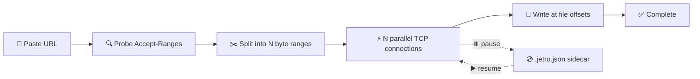

<div align="center">


<p><strong>A modern download manager for Windows with a segmented multi-connection
engine, queues with schedules, proxy &amp; VPN support, and a clean glass-style UI.</strong></p>

<p>
  <a href="package.json"></a>
  <a href="https://github.com/Erkalin/Jetro/releases"></a>
  <a href="https://www.electronjs.org/"></a>
  <a href="https://react.dev/"></a>
  <a href="LICENSE"></a>
</p>

<p>
  <a href="#-features">✨ Features</a> •
  <a href="#-getting-started">🚀 Getting Started</a> •
  <a href="#-project-structure">📁 Project Structure</a> •
  <a href="#️-how-downloading-works">⚙️ How It Works</a>
</p>

</div>

---

## 📥 Download

No installation needed — download, run, done. Get the latest version from the
[**Releases page**](https://github.com/Erkalin/Jetro/releases).

| OS | File | How to run |
| -- | ---- | ---------- |
| 🪟 Windows x64 | `Jetro <version>.exe` | Double-click to run |

## ✨ Features

### 📥 Downloading
| Feature | Description |
| ------- | ----------- |
| ⚡ Segmented engine | 1–32 parallel `Range` connections per file |
| ⏯️ Pause & resume | Resume support via `.jetro.json` sidecar files |
| 🚦 Speed control | Global speed limit + per-download connection count |
| 🗂️ Queues | Group downloads, limit concurrency, start/stop together |
| 🕐 Scheduler | Download only inside a time window (global + per-queue) |

### 🗃️ Organization
| Feature | Description |
| ------- | ----------- |
| 🏷️ Categories | Video, documents, archives, software, others |
| 🔍 Filters & search | Status filters plus instant filename/URL search |
| 🖼️ OS file icons | Shows the same icon File Explorer uses |
| 📋 Clipboard capture | Paste a link and Jetro picks it up automatically |
| 🔔 Notifications | Download-complete popups with open-file actions |

### 🌐 Network & Privacy
| Feature | Description |
| ------- | ----------- |
| 🌍 Proxy modes | Direct, system (OS settings / PAC / env fallback), or custom |
| 🔌 Proxy protocols | HTTP / HTTPS / SOCKS4 / SOCKS5 with auth + bypass list |
| 🛡️ VPN detection | Detects your system VPN tunnel + public-IP check |
| 🚨 Kill-switch | Auto-pauses downloads if the VPN tunnel drops |
| ⚙️ Safe settings | Unsaved-changes guard so you never lose edits by accident |

---

## 🚀 Getting Started

> **Requirements:** [Node.js](https://nodejs.org/) 20+ and Windows.

```powershell
# 1️⃣ Install dependencies
npm install

# 2️⃣ Run the full app (Vite on :5173 + Electron with devtools)
npm run app:dev
```

### 📜 Scripts

| Command | Description |
| ------- | ----------- |
| `npm run dev` | 🌐 Vite dev server only (web preview, no backend) |
| `npm run app:dev` | ▶️ Full app: Vite + Electron |
| `npm run build` | 🔨 Type-check + production renderer build |
| `npm run build:electron` | 🧩 Compile the Electron main process |
| `npm run electron:build` | 📦 Build portable app for this OS → `release/` |
| `npm run test:engine` | 🧪 Engine-only download test, no GUI |

```powershell
# 🧪 Test the engine headlessly (custom URL + output file supported)
npm run test:engine -- https://speed.hetzner.de/10MB.bin
```

---

## 📁 Project Structure

```
Jetro/
├── 📂 electron/            # Main process: window, IPC, engine, proxy/VPN
│   ├── main.ts             # 🪟 App entry, BrowserWindow, all IPC handlers
│   ├── preload.ts          # 🔒 Secure renderer bridge (contextIsolation)
│   ├── downloader.ts       # ⚡ Segmented download engine
│   └── proxy.ts            # 🌍 Proxy resolution + VPN detection
├── 📂 src/                 # Renderer (React)
│   ├── App.tsx             # 🖥️ UI
│   ├── main.tsx            # 🚪 React entry
│   ├── index.css           # 🎨 Styles
│   ├── global.d.ts         # 📝 Renderer API typings
│   └── assets/             # 🖼️ Images bundled by Vite
├── 📂 scripts/             # Dev/test scripts (never shipped)
│   └── test-engine.ts      # 🧪 Engine-only download test, no GUI
├── 📂 public/              # Static files (favicon, runtime app icon)
├── 📂 build/               # Installer icon (icon.ico)
├── index.html              # 🌐 Renderer HTML entry
├── vite.config.ts          # ⚙️ Vite config
├── tsconfig.json           # 📘 Renderer + shared TS config
├── tsconfig.electron.json  # 📗 Main-process TS config
└── tsconfig.scripts.json   # 📙 Scripts TS config
```

---

## ⚙️ How Downloading Works



Jetro probes `Accept-Ranges`, splits the file into N ranges downloaded over N
parallel connections writing directly at file offsets, and resumes from a
`.jetro.json` sidecar file. A global token bucket enforces the speed limit. 🚦

---

## 🤝 Contributing

Issues and pull requests are welcome!
Please check the [issues page](https://github.com/Erkalin/Jetro/issues) first. 💬

## 📄 License

[MIT](LICENSE) © 2026 Erkalin 💙
