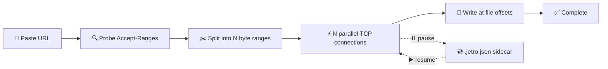

<div align="center">


<p><strong>A modern download manager for Windows with a segmented multi-connection
engine, video and audio downloads from social media platforms, batch
downloads, proxy support, 40-language UI, 27-theme gallery, portable and
installer builds, a browser extension,
and a modern interface.</strong></p>

<p><a href="README-fa.md">مستندات فارسی</a></p>

<p>
<a href="package.json"></a>
  <a href="https://github.com/Erkalin/Jetro/releases"></a>
  <a href="https://www.electronjs.org/"></a>
  <a href="https://react.dev/"></a>
  <a href="LICENSE"></a>
</p>

<p>
  <a href="#-preview">👀 Preview</a> •
  <a href="#-features">✨ Features</a> •
  <a href="#-getting-started">🚀 Getting Started</a> •
  <a href="#-project-structure">📁 Project Structure</a> •
  <a href="#️-how-downloading-works">⚙️ How It Works</a>
</p>

</div>

---

## 👀 Preview


## 📥 Download

Download the latest version from the
[**Releases page**](https://github.com/Erkalin/Jetro/releases).

| OS | File | How to run |
| -- | ---- | ---------- |
| 🪟 Windows x64 (portable) | `Jetro.exe` | Run directly, no installation |
| 🪟 Windows x64 (installer) | `Jetro Setup.exe` | Install per-user (desktop + Start Menu shortcuts, run after finish) |

Both builds include all components required for video and audio downloads
(`yt-dlp`, `ffmpeg`, `quickjs`). No separate installation is required.

## ✨ Features

### 📥 Downloading

| Feature | Description |
| ------- | ----------- |
| ⚡ Segmented engine | 1–32 parallel `Range` connections per file |
| 🚦 Speed control | Global speed limit presets (`Unlimited`, `100 KB/s`, `256 KB/s`, `512 KB/s`, `1 MB/s`, `2 MB/s`, `5 MB/s`, `10 MB/s`) + per-download connections (`1`, `4`, `8`, `16`, `32`) |
| 🔁 Auto-retry | Failed downloads are re-queued with exponential backoff instead of stopping at error |
| 📦 Batch download | Add up to 200 file parts at once with a `*` pattern (numbers or letters), with live preview and link resolving |

### 🎬 Video & Audio

Powered by the bundled `yt-dlp` + `ffmpeg`, with `quickjs` for player challenges.
Paste a link from YouTube, TikTok, Instagram, Reddit, Vimeo, Dailymotion,
Twitch, Facebook, X/Twitter and
[1000+ more websites](https://github.com/yt-dlp/yt-dlp/blob/master/supportedsites.md).

| Feature | Description |
| ------- | ----------- |
| 🔍 Detect qualities | `Detect qualities` / `Detect again` with `Show details` / `Hide details` log |
| 🎞️ Video picker | Choose `mp4` video format from `144p` to `8K` |
| 🎧 Audio picker | `AUDIO - best available per format` |
| 💬 Subtitles | `Subtitles (EN)` — writes and embeds English subtitles when available |
| 📃 Playlists | `PLAYLIST — {count} videos` (first 50 shown) with `Select all` / `Clear`; each selection becomes its own download |
| 🍪 Cookies | Login support via pasted `cookies.txt` content or a cookie file from disk, with a cookie-exporter extension link |
| 🛠️ Bundled tools | `yt-dlp` + `ffmpeg` + `quickjs` shipped in `bin/` and auto-resolved (custom `yt-dlp` path supported) |

> Video/audio downloads run via yt-dlp, which manages its own connections —
> queues don't apply.

### 🗂️ Queues & Scheduler

| Feature | Description |
| ------- | ----------- |
| 🗂️ Queues | Group downloads, start/stop together; concurrency follows the global `Concurrent downloads` setting |
| 🕐 Scheduler | Per-queue 24-hour time windows (e.g. `22:00–07:00`, overnight supported) with `Run only on schedule` and `Start` / `Stop` (`HH:MM`) |
| ⏻ Power action | `When queue finishes (all completed)`: `Do nothing` / `Sleep` / `Hibernate` / `Shutdown` / `Restart`, with a 60-second countdown dialog (`{Action} now` / `Cancel`); fires only when every file in the queue is completed |

### 🎨 Appearance, Language & System

| Feature | Description |
| ------- | ----------- |
| 🎨 Themes | 27-theme gallery (`Jetro`, `Midnight`, `System`, `Gray`, `Silver`, `Crimson`, `Coral`, `Amber`, `Teal`, `Navy`, `Turquoise`, `Indigo`, `Aqua`, `Nord`, `Dracula`, `Solarized`, `Forest`, `Blossom`, `Espresso`, `Lavender`, `Ember`, `Pistachio`, `Ruby`, `Scarlet`, `Gold`, `Hunter`, `Clover`) with palette-dot picker, live preview and a header sun/moon toggle (remembers your last light/dark pick; old `Light`/`Dark` settings migrate to `Jetro`/`Midnight`) |
| 🌍 Language | Full UI in 40 languages from Settings → App via a flag picker (`English`, `فارسی` pinned first, plus `العربية`, `Türkçe`, `Français`, `Deutsch`, `Español`, `Русский`, `简体中文`, `हिन्दी`, `Português`, `Italiano`, `Nederlands`, `日本語`, `한국어`, `اردو`, `Bahasa Indonesia`, `Polski`, `Українська`, `Tiếng Việt`, `繁體中文`, `עברית`, `کوردی (سۆرانی)`, `Azərbaycanca`, `বাংলা`, `தமிழ்`, `తెలుగు`, `ไทย`, `Bahasa Melayu`, `Filipino`, `Svenska`, `Norsk`, `Dansk`, `Suomi`, `Ελληνικά`, `Magyar`, `Čeština`, `Română`, `Português (Brasil)`, `Español (Latinoamérica)`), with RTL layout for `fa` / `ar` / `ur` / `he` / `ku` and bundled Iranyekan font. English and Persian are human-translated; the other 38 languages are AI-translated — please report mistakes via [Issues](https://github.com/Erkalin/Jetro/issues) |
| 📌 System tray | `When I click the X button`: `Ask every time` / `Minimize to tray` / `Exit app`, with `Remember my choice`; tray menu with `Show` and `Quit`; single instance; downloads continue while minimized |
| 🚀 Launch at startup | `Launch at startup` (installer build only, disabled in portable): starts Jetro minimized to the tray when Windows starts, with orphaned login-item cleanup on boot/reinstall/uninstall |
| 🔄 Update check | `Check for updates on startup` plus manual `Check now` (GitHub Releases) and an in-app banner (`Download` / `Later`) |
| 📊 Details & speed | Per-download view with live/average/peak speed, speed-over-time graph, per-connection progress, and server host/IP + location |

### 🧩 Browser extension (new in v1.0.0)

Jetro Resolver is located in `extension/` — a Chromium MV3 extension (Chrome,
Edge, Brave, Opera, Vivaldi, with Firefox compatibility). Send any link,
image, video, or page to Jetro via the context menu, or click a direct file
link to open it in the application instead of the browser. Communication with
the desktop application is handled via the `jetro://add?url=...` protocol
(registered on first run). See
[`extension/README.md`](extension/README.md) for installation instructions.

### 🌐 Network & Privacy

| Feature | Description |
| ------- | ----------- |
| 🌍 Proxy modes | `No proxy (direct connection)`, `Use system proxy` (OS settings / PAC / env fallback), or `Custom proxy` |
| 🔌 Proxy protocols | `HTTP` / `HTTPS` / `SOCKS4` / `SOCKS5` with auth + `Bypass (comma-separated, always skips localhost)` |

### ⚙️ Settings reference

`Settings` is grouped into sections:

- **General:** `Default download folder`, `Connections` (`1` / `4` / `8` / `16` / `32 connections`), `Concurrent downloads` (`1–10`), `Speed limit` (`Unlimited` … `10 MB/s`), `Clipboard auto-capture`.
- **Auto-retry:** `Retry failed downloads`, `Max retries` (`0–10`), `Base delay (sec)` (`1–300`, exponential backoff).
- **App:** `Language` (40-language flag picker), `Theme` (27-theme gallery with instant preview), `When I click the X button` (`Ask every time` / `Minimize to tray` / `Exit app`), `Launch at startup` (installer only — `Not available in the portable version`).
- **Proxy:** `Proxy mode`, `Type`, `Host`, `Port`, `Username (optional)`, `Password (optional)`, `Bypass`.
- **Others:** `yt-dlp` status (`● yt-dlp {version}` / `○ yt-dlp missing`) with `Refresh` and folder reveal, `Check for updates on startup` with `Check now` / `Download`.
- **Danger zone:** `Reset app…` — stops everything and clears the list, queues, settings and speed history (files on disk are kept).

Other dialogs: `New download`, `New Batch Download` (step 1 options + step 2 `Batch links ({n})` resolving with `OK` / `Failed` rows and `Download ({n})`), `Change file format?` (`Download anyway` / `Use original name` / `Cancel`), `Create New Queue` / `Edit Queue`, `Discard unsaved changes?` (`Save Changes` / `Keep Editing` / `Discard Changes`), `Close Jetro?` (`Minimize to tray` / `Exit Jetro` / `Cancel`), `Download complete`, `Delete download?` / `Cancel download?` (`Keep file` / `Keep downloading` / `Delete file` / `Remove download`).

---

## 🚀 Getting Started

> **Requirements:** [Node.js](https://nodejs.org/) 20+ and Windows.

```powershell
# 1️⃣ Install dependencies
npm install

# 2️⃣ Fetch bundled video tools (yt-dlp, ffmpeg, quickjs) into bin/
npm run fetch:binaries

# 3️⃣ Run the full app (Vite on :5173 + Electron with devtools)
npm run app:dev
```

### 📜 Scripts

| Command | Description |
| ------- | ----------- |
| `npm run dev` | Vite dev server only (web preview, no backend) |
| `npm run app:dev` | Full application: Vite + Electron |
| `npm run build` | Type-check + production renderer build |
| `npm run build:electron` | Compile the Electron main process |
| `npm run electron:build` | Build portable + installer for this OS → `release/` (`Jetro.exe`, `Jetro Setup.exe`) |
| `npm run fetch:binaries` | Download yt-dlp / ffmpeg / quickjs into `bin/` |
| `npm run test:engine` | Engine-only download test, no GUI |

```powershell
# Test the engine without the UI (custom URL + output file supported)
npm run test:engine -- https://speed.hetzner.de/10MB.bin
```

---

## 📁 Project Structure

```
Jetro/
├── 📂 electron/            # Main process: window, IPC, engine, proxy, video
│   ├── main.ts             # 🪟 App entry, BrowserWindow, tray, jetro:// protocol, themes, launch-at-startup, all IPC handlers
│   ├── preload.ts          # 🔒 Secure renderer bridge (contextIsolation)
│   ├── downloader.ts       # ⚡ Segmented download engine (global speed limit, smoothed speed)
│   ├── proxy.ts            # 🌍 Proxy resolution
│   └── binaries.ts         # 🛠️ yt-dlp / ffmpeg / quickjs resolution (single-file yt-dlp, legacy dup cleanup)
├── 📂 extension/           # 🧩 Jetro Resolver browser extension (MV3) + its own README
├── 📂 src/                 # Renderer (React)
│   ├── App.tsx             # 🖥️ UI (cards/details, video, batch, queues, settings)
│   ├── main.tsx            # 🚪 React entry (wraps App in LanguageProvider)
│   ├── index.css           # 🎨 Style entry — imports per-area files in styles/
│   ├── styles/             # 🎨 Split styles (settings, sidebar, modals, analytics, rtl, themes, …)
│   ├── locale/             # 🌍 40 languages (en.ts + fa.ts + 38 more) + languages.ts registry + LanguageContext
│   ├── components/         # 🧩 DownloadAnalytics, SpeedGraph, OsFileIcon, ThemePicker, LanguagePicker, FlagIcon, …
│   ├── hooks/              # 🪝 useSpeedHistory, useExclusiveDropdown, …
│   ├── lib/ hooks/ api/    # 🛠️ Formatting, URL/batch helpers, speed history, themes, backend wrapper
│   ├── fonts/              # 🔤 Bundled Iranyekan (Persian) font
│   ├── global.d.ts         # 📝 Renderer API typings
│   └── assets/             # 🖼️ Images bundled by Vite (Jetro.png, Jetro-notext.png, flags/)
├── 📂 scripts/             # Dev/test scripts (never shipped)
│   ├── test-engine.ts      # 🧪 Engine-only download test, no GUI
│   ├── fetch-binaries.ts   # ⬇️ Fetch yt-dlp / ffmpeg / quickjs into bin/
│   ├── after-pack.ts       # 📦 Strip unused Electron locales (~39 MB saved)
│   └── build-release.ts    # 📦 Portable (`Jetro.exe`) + installer (`Jetro Setup.exe`) builds
├── 📂 bin/                 # Bundled video tools (yt-dlp, ffmpeg, quickjs)
├── 📂 build/               # Installer icon (icon.ico), installer sidebar + script (installerSidebar.bmp, installer.nsh)
├── 🖼️ preview.png          # App screenshot used above
├── index.html              # 🌐 Renderer HTML entry
├── vite.config.ts          # ⚙️ Vite config
├── tsconfig.json           # 📘 Renderer + shared TS config
├── tsconfig.electron.json  # 📗 Main-process TS config
└── tsconfig.scripts.json   # 📙 Scripts TS config
```

---

## ⚙️ How Downloading Works



Jetro probes `Accept-Ranges`, splits the file into N ranges downloaded over N
parallel connections writing directly at file offsets, and resumes from a
`.jetro.json` sidecar file. A single global token bucket enforces the speed
limit across all connections and concurrent downloads, and speed readings are
smoothed to keep the displayed speed and ETA stable.

Video and audio pages take a separate path: Jetro resolves them with the bundled
`yt-dlp`, selects the requested height / audio format, then merges to `mp4` or
extracts audio with the bundled `ffmpeg`. Playlists are expanded (first 50
shown) so each entry becomes its own download.

Batch downloads expand a `*` pattern into up to 200 URLs, resolve each link
for filename and size, then add them lowest-first into a dedicated queue.

---

## 🤝 Contributing

Issues and pull requests are welcome.
Please check the [issues page](https://github.com/Erkalin/Jetro/issues) first.

## 📄 License

[MIT](LICENSE) © 2026 Erkalin
